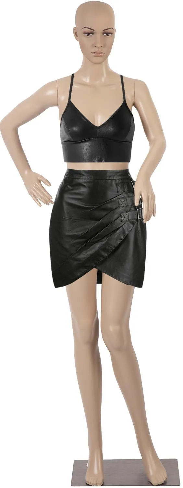

# 🎭 Face & Hand Segmentation using SAM2 API

This project implements a fully automated pipeline that detects faces and hands in any input image and segments them using Meta's **Segment Anything Model v2 (SAM2)** via Replicate API.

It uses:
- 🔍 **YOLOv8** models for detection
- 🎯 **SAM2 API** for precise segmentation
- 🎨 Clean visualizations with overlays, contours, and binary masks
- 🌐 An interactive Gradio UI for real-time testing

---

## 🚀 Demo

Upload your image via the Gradio interface and get:
- Segmented faces (💛 Yellow)
- Segmented hands (💜 Magenta)
- Binary mask
- Contour visualization

---

## 📁 Folder Structure
├── app.py # Gradio UI interface
├── main.py # Core detection + segmentation logic
├── yolov8n-face.pt # YOLOv8 face model
├── hand_yolov8n.pt # YOLOv8 hand model
├── .env # Contains Replicate API key (not pushed to GitHub)
├── requirements.txt # Python dependencies
├── Readme.md # Project documentation
├── input_samples/ # Sample input images
├── output/ # Sample outputs (masks, overlays)
└── .gitignore # Files/directories excluded from Git

## 🔧 Setup Instructions

### 1. Clone the repository
git clone https://github.com/RMdot02/face-hand-segmentation-sam2.git
cd face-hand-segmentation-sam2

### 2. Create and activate a virtual environment
python -m venv venv310
venv310\Scripts\activate   # For Windows
# Or: source venv310/bin/activate  # For Mac/Linux

### 3. Install requirements
pip install -r requirements.txt

### 4. Add your Replicate API key
REPLICATE_API_TOKEN=your_replicate_api_key_here

## How It Works

### Detection:
Uses YOLOv8 models (yolov8n-face.pt, hand_yolov8n.pt) to detect face and hand bounding boxes.

Segmentation (SAM2):
For each bounding box, the center point and box are sent to the SAM2 model via Replicate API.

### Post-Processing:

Filters large/invalid masks

Applies morphological operations

Validates mask overlap with original box

### Visualization:

Segmented result with color overlays

Contour map

Binary mask image

### 💡 Features
✅ End-to-end automation

🧠 Robust face & hand detection

🔍 Point + box prompts to SAM2 for precision

🎨 Clean visual output (overlays, contours, binary masks)

🌐 Gradio-based interactive UI

## 📸 Sample Inputs & Outputs
Input Image 	                                                 Segmentation	                                     
                                     

Contour                                                          Binary Mask
                  
     !

## ⚠️ Limitations
SAM2 API can timeout or fail for highly complex or low-resolution images.

Segmenting small or partially occluded faces/hands may be inaccurate.

Replicate API requires an internet connection and active API key.

### 📜 License
This project is for educational/demo purposes and follows MIT License.

### 🙌 Acknowledgements
Meta AI - Segment Anything v2 (SAM2)

Replicate API

Ultralytics YOLOv8

Gradio

### 📬 Contact
Author: Rishabh Mahendroo
Email: rishabhmahendroo2@gmail.com
LinkedIn: www.linkedin.com/in/rishabhmahendroo2

